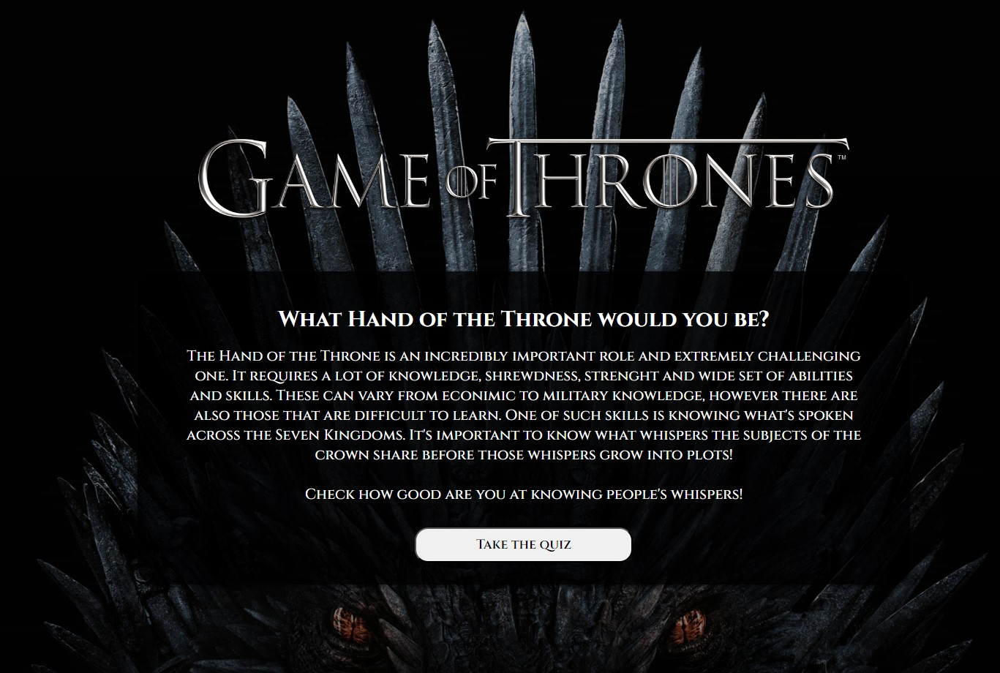

# **Game of Thrones Quiz**

## Main Goals

The project was made upon finishing ≈30% of React course and had the goal to structure & strengthen the knowledge of the concepts learned, such as states, hooks, CSS modules and working with fetch API. The idea was to practice React fundamentals and key features as well as to get experience with fetching data and working with received data, handling potential errors, etc.

## Technologies Used

1. React
2. CSS Modules
3. Fetch API

## Things to Improve

1. The project is using props drilling, however using context could be a better solution
